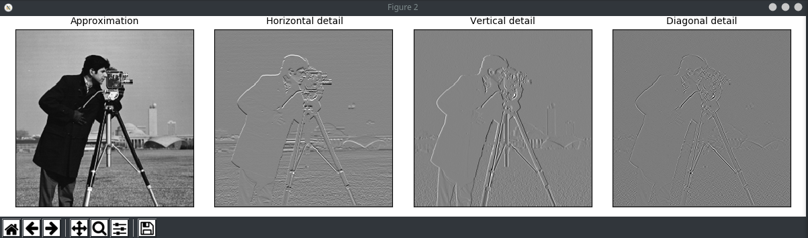
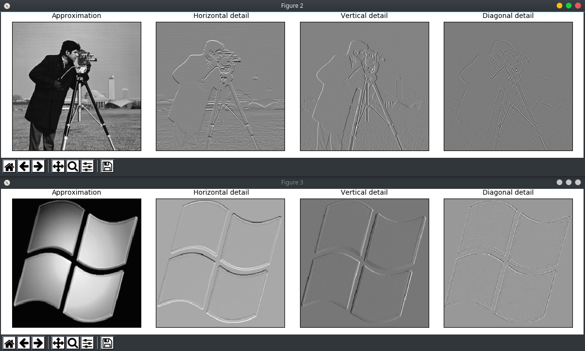
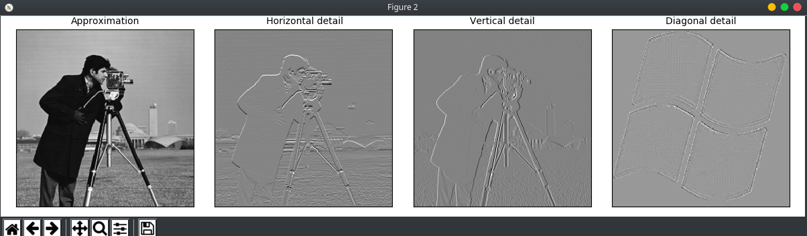
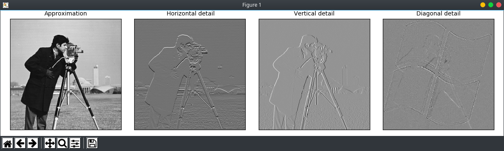

This week I had an homework assignment in class that actually caught my attention. Here is why and how I went about accomplishing it.

**TL;DR:** Check bottom of this post for the code I finished. Creates a watermark hidden in a picture using python discrete wavelet transforms.

## The Challenge
My professor handed me a python script which broke apart a generic photo into four varying detailed photos in grayscale. 



As you can see there are four differing types of detail in this image that have been broken apart. Approximation (original), Horizontal, Vertical, and Diagonal detail. What is happening is the image is being broken apart by an algorithm and displaying details of the photo based on draw position. What does this have to do with watermarks?

**Task:** Replace the diagonal detail of this image with the diagonal detail of another image, then rebuild it. This will create a sort of discrete watermark that can really only be seen by breaking the image apart in the same fashion.

## Poking Around..

Well I have literally not a clue what to do. I know some basic python and could probably fiddle my way around with a lot of the built-in libraries, however I still do not know a lot of it. But first thing is first—let's investigate the code.

```python
import numpy as np
import matplotlib.pyplot as plt

import pywt
import pywt.data


# Load image
original = pywt.data.camera()
#original = plt.imread("MySig.jpg")[600:1111,600:1111,1]
plt.figure()
plt.imshow(original, cmap=plt.cm.gray)

# Wavelet transform of image, and plot approximation and details
titles = ['Approximation', ' Horizontal detail',
          'Vertical detail', 'Diagonal detail']
coeffs2 = pywt.dwt2(original, 'bior1.3')
LL, (LH, HL, HH) = coeffs2
fig = plt.figure(figsize=(12, 3))
for i, a in enumerate([LL, LH, HL, HH]):
    ax = fig.add_subplot(1, 4, i + 1)
    ax.imshow(a, interpolation="nearest", cmap=plt.cm.gray)
    ax.set_title(titles[i], fontsize=10)
    ax.set_xticks([])
    ax.set_yticks([])

fig.tight_layout()
plt.show()
```

Do I know what any of this means? Of course not. I see a `for` loop, an array with the titles of the pictures, and a few imported libraries I am not familiar with. That's about it.

My first tactic is just to comment and uncomment to see what I break. To be clear, this is not an efficient method of reverse engineering, but because the block of code is small it's feasible. After playing around for a minute, I insert my own comments into the code after I figure out what certain lines do. And here, we can update the original code with my new comments.

```python
## LIBRARIES
import numpy as np
import matplotlib.pyplot as plt

import pywt
import pywt.data


## LOADS SOME PYTHON DEFAULT IMAGE AND A COMMENTED IMAGE IN THE CURRENT DIRECTORY
original = pywt.data.camera()
#original = plt.imread("MySig.jpg")[600:1111,600:1111,1]
## OPTIONAL DISPLAY OF ORIGINAL IN GRAPH
plt.figure()
plt.imshow(original, cmap=plt.cm.gray)


titles = ['Approximation', ' Horizontal detail',
          'Vertical detail', 'Diagonal detail']

## PYWT??? ASSIGNED VARIABLE THAT SPLITS APART IMAGE
coeffs2 = pywt.dwt2(original, 'bior1.3')
LL, (LH, HL, HH) = coeffs2

## FOR LOOP AND DISPLAY INFORMATION FOR ALL FOUR IMAGES
fig = plt.figure(figsize=(12, 3))
for i, a in enumerate([LL, LH, HL, HH]):
    ax = fig.add_subplot(1, 4, i + 1)
    ax.imshow(a, interpolation="nearest", cmap=plt.cm.gray)
    ax.set_title(titles[i], fontsize=10)
    ax.set_xticks([])
    ax.set_yticks([])

fig.tight_layout()
plt.show()
```
## Creating More Images
At this point, I still have plenty of questions, but from the looks of it I have at least isolated the important lines from the lesser. Now I have to keep in mind my goal: replace diagonal image 4 with my own, then rebuild. 

For now, that means the display information is fine however I can mostly ignore it; it's mostly for debugging. What immediately draws my attention is the set of four variables `LL, LH, HL, HH`. Without knowing any of the backend, I can safely assume that this relates to the four images. This also means that reading through the for loop I can assume the line `ax.imshow(a, interpolation="nearest", cmap=plt.cm.gray` means show the image of the position in the incrementing array. That long with the `title` array line must be display info. 

All right. We only have one or two lines that must be responsible for breaking up the image.

```python
## PYWT??? ASSIGNED VARIABLE THAT SPLITS APART IMAGE
coeffs2 = pywt.dwt2(original, 'bior1.3')
LL, (LH, HL, HH) = coeffs2
```

Honest thoughts? What is pywt other than part of a library? **boir1.3**?? Is that assigning the value of a single variable repeatedly to 4 variables?? Something is up here. But when it doubt, turn to Google right?
## Reverse Understanding
Well surely enough the first thing that comes up with the discrete wavelet transform in python via the [pywvelets docs](https://pywavelets.readthedocs.io/en/latest/ref/2d-dwt-and-idwt.html). Perfect. The `dwt2` function requires two inputs: data of some sort and a wavelet form. The one that appears in the above example looks like **boir1.3**. Well without fully understanding how the wavelet transform works, we can determine that this is a a specific formula of the discrete wavelet transform. Perfect. Well here's what we can piece together. 
```python
original = pywt.data.camera()
#############################
coeffs2 = pywt.dwt2(original, 'bior1.3')
LL, (LH, HL, HH) = coeffs2
```
Looks like the original photo is broken up by the `pywt.dwt2` function and assigned to `coeffs2`. Then the data generated (in an array format as a tuple) is assigned to separate variables. There is the approximation, horizontal detail, vertical detail, and diagonal detail coefficients. Bingo! We have the data for photo now. 

If the goal is to replace the diagonal portion of the photo with my own, then I need my own photo to go through this same process. Well I noticed a commented line with photo file importation earlier, so I'll uncomment that and add a photo.
```python
### IMPORT OF NEW INTENDED WATERMARK
watermark = plt.imread("XP.jpg")[0:1111,0:1111,1] 
#   Changed 600:1111 -> 0:1111
### WAVELET TRANSFORM AND FIGURE CREATION
coeffsNew = pywt.dwt2(watermark, 'bior1.3') # Watermark coeffs data
LLn, (LHn, HLn, HHn) = coeffsNew # New (n) data in tuples
figNew = plt.figure(figsize=(12,3))
### LOOP FIGURE TO DISPLAY
for i, a in enumerate([LLn, LHn, HLn, HHn]):
    ax = figNew.add_subplot(1, 4, i + 1)
    ax.imshow(a, interpolation="nearest", cmap=plt.cm.gray)
    ax.set_title(titles[i], fontsize=10)
    ax.set_xticks([])
    ax.set_yticks([])
### DISPLAY STUFF FOR LOOP
figNew.tight_layout()
```
*Note: the watermark photo is 512x512 to avoid data errors in calculation later.*

Okay so let's break down what has been done quickly. A custom watermark photo has been added (notice the changes from the original commented line). Next we basically **copied** the original code with *new* changes. These include the following:
`coeffs2` -> `coeffsNew` | To hold new calculated coefficients
`fig` -> `figNew` | For new display figure
`LL...` -> `LLn...` | For new values from my watermark

All right then. We've not deleted any of the other code yet; just added new code. Let's run the program and see what we have.



Bingo 2! We have made the detail for both images. While displaying them is optional, we can now can understand how the details are assigned in variables and see what they are supposed to look like. Fantastic. What's left?
## Replace & Rebuild
Well honestly, now that we understand the values and have nearly reverse engineered the program, all that is left is to overwrite the last diagonal of the watermark with the original. Then export.

Looking at the code and documentation, this was a pretty easy change.
```python
for i, a in enumerate([LL, LH, HL, HHn]):
    ax = fig.add_subplot(1, 4, i + 1)
    ax.imshow(a, interpolation="nearest", cmap=plt.cm.gray)
    ax.set_title(titles[i], fontsize=10)
    ax.set_xticks([])
    ax.set_yticks([])
```
Commenting the previously added for loop and associated display code (because we no longer need it knowing how the values are assigned) and switching the original `HH` for `HHn`, we can display the diagonal image. This will display the image.



Cool. We can see the image does display in the diagonal, but how do we rebuild the image? 

Honestly I had no idea. I first went about changing the `coeffs` to something new entirely and re-running the `dwt2` operation. Most of the time this kept erroring out. The second idea I had was to simply put the coefficient details displayed in the reverse order. Not my best idea, but I was quite lost. 

So I went back to the pywavelet docs and found a function called **Inverse Discrete Wavelet Transform** (`idwt2`). This is extremely similar to the original, but is....the inverse. Maybe that rebuilds the photo?

```python
finalImg = pywt.idwt2(LL, LH, HL, HHn, bior1.3)
```

Trying this by manually throwing in the modified coefficient variables kept erroring out as well. I really felt like I was on the right track; but why? To troubleshoot, I printed `coeffs2` and my own `coeffsNew`. Turns out, this is an array of arrays (tuples), and the `idwt2` function was not liking me sending 5 values to the method. Rather, it was looking for a single array of values and then the wavelet type. Oh okay. Let's try that.
```python
finalImg = pywt.idwt2((LL, (LH, HL, HHn)), bior1.3)
```
No errors. Also no display other than the original. I must have done something right at this point, but I still need to save and check the image (or at least display the new image by breaking it apart). This can be done with the following:
```python
plt.imsave('finalImg.png', finalImg)
```
## And.....butter.
Adding that line and running the program created a new image. But it looks the same as the original...nearly. 

**Original**


**Modified**


Maybe a bit darker (ignoring the green)? That's about it. But, if we run the modified **finalImg.png** through the original program, we can see that there truly is a watermark!



## Conclusion

This was a unique challenge that I wasn't expecting to get from class. I had a lot of fun reverse engineering the code that I did not know about. While I didn't learn as much about actually how wavelet transforms truly work, I was able to hobble around into a solution. What I was most excited about was that I re-designed (even if it was simple) a practical program that theoretically could be used in copyright claims for photos. 

Here's the final code if you were following along. 

**Code**
```python
import numpy as np
import matplotlib.pyplot as plt

import pywt
import pywt.data


# Load image
original = pywt.data.camera()
newImg = plt.imread("XP.jpg")[0:1111,0:1111,1]
# DISPLAY INFO
#plt.figure()
#plt.imshow(original, cmap=plt.cm.gray)

# Wavelet transform of image, and plot approximation and details
titles = ['Approximation', ' Horizontal detail',
          'Vertical detail', 'Diagonal detail']

coeffs2 = pywt.dwt2(original, 'bior1.3')
LL, (LH, HL, HH) = coeffs2


# MY ADDITIONS
coeffsNew = pywt.dwt2(newImg, 'bior1.3')
LLn, (LHn, HLn, HHn) = coeffsNew
finalImg = pywt.idwt2((LL, (LH, HL, HHn)), 'bior1.3')

# SAVE IMAGE
plt.imsave('finalImg.png', finalImg)
# DISPLAY INFO
#fig.tight_layout()
#plt.show()

## TEST TO SHOW CHANGE AUTOMATICALLY
testImg = plt.imread("finalImg.png")[0:1111,0:1111,1]
coeffs3 = pywt.dwt2(testImg, 'bior1.3')
LLt, (LHt, HLt, HHt) = coeffs3
fig = plt.figure(figsize=(12, 3))


for i, a in enumerate([LLt, LHt, HLt, HHt]):
    ax = fig.add_subplot(1, 4, i + 1)
    ax.imshow(a, interpolation="nearest", cmap=plt.cm.gray)
    ax.set_title(titles[i], fontsize=10)
    ax.set_xticks([])
    ax.set_yticks([])

fig.tight_layout()
plt.show()
```
